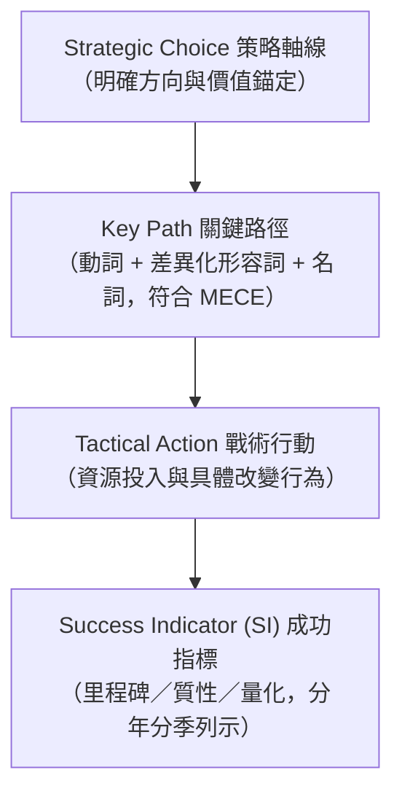
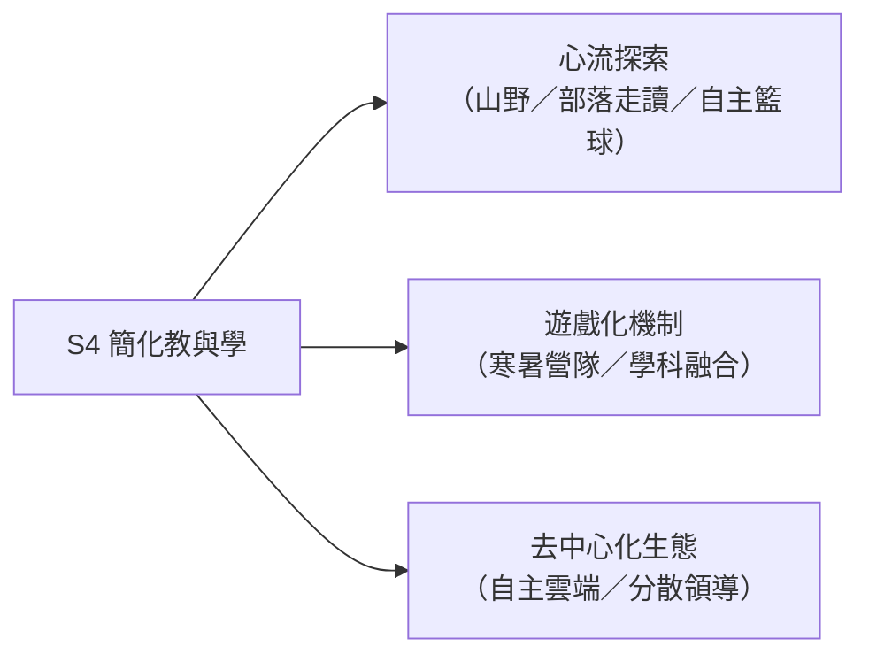

---
{"title":"憲明國小 SPTS 策略藍圖：打造低熵、靜定與自主學習的微型教育生態","categories":["校務","部落格"],"tags":["憲明國小","SPTS","辦學理念","正念教育","數位學習","第二大腦","熵減"],"status":"🌱","created":"2026-09-17T13:48:40.264+08:00","dg-publish":true,"permalink":"/Notes/憲明SPTS/","dgPassFrontmatter":true,"noteIcon":"","updated":"2026-09-17T13:58:08.562+08:00","dg-note-properties":{"title":"憲明國小 SPTS 策略藍圖：打造低熵、靜定與自主學習的微型教育生態","categories":["校務","部落格"],"tags":["憲明國小","SPTS","辦學理念","正念教育","數位學習","第二大腦","熵減"],"status":"🌱","created":"2026-09-17"}}
---


# 憲明國小 SPTS 策略藍圖：打造低熵、靜定與自主學習的微型教育生態

> **「做功於日常，減熵於系統；讓實體有歸屬，讓數位更流暢，讓每個孩子在大腦之外學會自主思考。」**

在教育現場，我們常看到許多繁複的行政評鑑、割裂的活動方案與疲於奔命的教學日常。當來到宜蘭三星鄉天送埤這座被群山與蔥田環抱的精緻小校——**憲明國小**，我們不禁思索：一所偏鄉小校，如何擺脫體制的「熵增」（混亂與耗能），在有限的資源中，為師生打造一座既安定心靈、又能連結未來的教育淨土？

這份 **「憲明 SPTS 策略藍圖」**，正是我們將系統思維、正念哲學、數位「第二大腦」與在地生態深度交融的整體實踐路徑。

---

## 一、解碼 SPTS：策略管理的系統工程

在進入具體實踐之前，我們首先確立了 **SPTS** 的策略推動框架。任何願景若沒有清晰的路徑與指標支持，終究只是口號；因此，SPTS 構築了一條嚴謹的行動閉環：



1. **Strategic Choice（策略軸線）**：界定核心方向，每一項策略軸線必須有後續的關鍵路徑、戰術行動與成功指標全面支撐。
2. **Key Path（關鍵路徑）**：以 **「動詞 ＋ 差異化形容詞 ＋ 名詞」** 精準陳述，並嚴格遵循 MECE 原則（相互獨立、完全窮盡），杜絕模糊與職能重疊。
3. **Tactical Action（戰術行動）**：明確列出需投入的關鍵資源、組織必須改變的行動項目，確保戰術與戰略意圖的高度一致性。
4. **Success Indicator（成功指標 SI）**：定義驗證行動成效的衡量標準（包含各階段里程碑指標、質性回饋與量化數據），分年、分季具體列示。

循著這套架構，我們梳理出推動憲明國小轉型升級的 **四大策略軸線（S1 ~ S4）**。

---

## 二、S1 學習環境：實體有歸屬感，數位完善易用

一所理想的學校，應當是學生「身、心、靈」都能安頓的道場。S1 著眼於打造實體與數位無縫融合的無壓力學習環境。

### 1. 營造輕鬆自在的無負擔情境
* **校園綠美化與無障礙空間**：打破生硬的界線，讓綠意由外而內漫入教室，落實友善校園空間設計，讓每位孩子都能安全、無障礙地探索校園各個角落。
* **心理安全感建立**：每天從校門口一句真誠的問候開始，「微笑並祝福自己與他人」，在校園文化底層建立毫無威脅的心理容器。

### 2. 身心校準：能快速靜定心回到當下
偏鄉小校往往面臨孩子將外在家庭與生活壓力帶入課堂的情緒熵增。我們透過三項具體身心儀式，協助大腦回到平穩波段：
* **導入「正念覺察」**：安排於每日**第一節**與**第五節**上課前進行。透過 2–3 分鐘的專注呼吸與五感掃描，迅速安定浮動心緒。
* **引入「禪跑與超慢跑」**：融入體育與健體課，讓運動不再是激烈的競技勝負，而是引導學生在穩定的呼吸與腳步律動中，體會身心合一的動態靜心。
* **推動「FreeWriting（直心書寫）」**：
  * 各科教學前視需要實施（每週 1–3 次）：讓學生在開課前隨心傾倒大腦雜念，騰出工作記憶空間。
  * 導師時間（每週一次）：深入梳理每週心境與成長收穫。

### 3. 無所不在的輕鬆自主學習角落
* **全場域 Wi-Fi 漫遊覆蓋**：全校各班級教室及戶外學習角落地圖全面建置 Wi-Fi 漫遊（進度已達 100%），並持續監控部落與校園網路品質，打破圍牆限制。
* **低藍光護眼健康方案**：全面更換少藍光護眼燈具，並逐步導入 **E-INK（電子紙顯示設備）**，保護發育期學生的視力健康，營造溫潤如紙本的閱讀體驗。
* **自主可控的易用儲存系統**：
  * 建構基於 **PARA 方法** 的私有 Workspace 儲存中心（`http://140.111.189.1:5000/`），讓校務與課程資產結構化。
  * 架設 **NextCloud** 雲端私有儲存系統（`https://fun.ilc.edu.tw/nextcloud/`），確保教學檔案跨平台傳輸快速且隱私安全。

---

## 三、S2 個別化學習：自備設備 (BYOD) 與打造「第二大腦」

教育的終極目標是培養獨立自律的個體。在 S2 中，我們強調：**「設備以使用自己的為主（BYOD），學校設備為輔；方法則由孩子自主選擇。」**

```
大腦是用來產生想法的，不是用來記憶瑣碎細節的。
—— 打造第二大腦，在大腦之外思考。
```

### 1. BYOD 設備自主掌控力
* 引導孩子認識、整理與優化自己隨身攜帶的數位載具，而非單向接受制式發放的設備。
* 錄製跨作業系統（Windows / macOS / Android / iOS / Linux）的操作教學短片，讓孩子具備自主除錯與系統維護的基礎數位素養。

### 2. 導入 Obsidian：打造個人專屬數位日誌系統
將當代最頂尖的個人知識管理工具（PKM）**Obsidian** 系統化導入小學生活：
* **教師社群先行**：透過每週三教師專業進修、教師朝會，帶領老師建立教學筆記庫、行政待辦看板與教學反思日誌。
* **學生深耕推展**：利用兒童朝會宣導、每週導師時間及各科課程融入，教導孩子記錄學習日誌、好點子與反思。
* **推廣「禪學筆記術」**：舉辦教師工作坊、暑期兒童學習營，並辦理筆記成果比賽，引導師生用極簡符號與客觀覺察進行高效思維記錄。

### 3. 心智圖法的認知深化（Mindomo 實戰）
* **教學平台上線**：錄製 Mindomo 操作影片、編纂結構化教材，讓心智圖法的學習隨選隨看。
* **思維外顯化比賽與展演**：定期舉辦全校心智圖法挑戰賽，辦理期末心智圖成果展，讓孩子學會用樹狀結構拆解複雜問題，看見知識的全貌。

---

## 四、S3 如實支持：接納當下與感恩氛圍

經營一所學校，領導者的心境決定了組織的溫度。S3 構築了一張厚實的心理安全網，讓師生敢於冒險、如實做自己。

### 1. 倡導教育最高心法
* **「一切都是最好的安排」**：面對生活中的意外與挫折，不急著歸咎與抱怨，以臣服與開放的視角接納挑戰。
* **「無分別心」**：無論學生的學術天賦如何、家庭背景如何，皆給予平等的尊重、等待與無條件的信任。

### 2. 打造正向激勵循環
* **導入「智慧 E 幣」**：將日常優良習慣、互助合作與自主突破轉化為數位激勵貨幣，結合彈性兌換機制，提升內在動機。
* **徽章成就體系**：為各項特色專長（如生態導覽、攝影小達人、直心書寫、體能耐力）設計專屬徽章，肯定多元智慧。

### 3. 深化三維感恩文化
* **感念人**：日常中向身旁的同儕、廚工媽媽、導護志工與師長真誠致謝。
* **感念事**：珍惜校園每一次活動與考驗帶來的生命修煉。
* **感念大自然**：感恩天送埤的土地、水源與森林，培育對天地自然的敬畏之情。

---

## 五、S4 簡化教與學：心流湧現、遊戲化與去中心化

傳統教學常塞入過多的重複性練習與繁文縟節。S4 的核心在於**「化繁為簡」**，讓學習回歸體驗本質，喚醒孩子內在的好奇心。



### 1. 尋求心流（Flow）的學習模式
* **山野教育與部落在地遊學**：走出課本，將教室搬進三星蔥田、安農溪畔與周邊山林步道，在真實情境的探險中激發深度專注的心流體驗。
* **籃球運動自主管理**：以球隊為載體，引導學生自主安排熱身、戰術演練與賽後復盤，在汗水與團隊默契中鍛鍊挫折容忍力。

### 2. 遊戲化（Gamification）教學設計
* **寒暑假學習營隊**：結合學校自辦體驗活動，並積極引入大專院校志願服務資源，設計任務導向、闖關破關的沉浸式營隊。
* **學科日常遊戲化融入**：將死板的記憶科目轉化為點數、解謎與小組競合的學習任務。

### 3. 去中心化（Decentralization）的辦學哲學
* **數位去中心化**：不盲目依賴單一封閉的商業平台，善用開源工具、私有雲端與邊緣運算，保障校園數據主權與自由度。
* **生活與組織去中心化**：落實分層負責與彈性授權，鼓勵教師自主發起微型跨領域專案，讓學校由「單一校長主導」蛻變為「師生自治、自組織運轉」的生機體。

---

## 六、結語：在後疫情時代，以行動學習走向自主教育

在後疫情與行動學習（Mobile Learning）交織的今天，校園早已不再受限於四面水泥牆。

這份 **憲明 SPTS**，既是一套講求邏輯與 MECE 的經營綱領，更是一份以孩子生命成長為核心的教育發願：
* 從 **S1 的靜定與護眼環境** 出發，給孩子一個能夠安住當下的身心容器；
* 透過 **S2 的 BYOD 與第二大腦**，賦予孩子終身帶得走的資訊加工與思維工具；
* 在 **S3 如實支持與三維感恩** 中，奠定良善、安定、無分別心的人格基石；
* 最終在 **S4 的心流體驗與去中心化實踐** 裡，讓教與學化繁為簡，釋放無限生機。

讓教育不再是沉重的負擔，而是一場在大自然與數位星空中，師生攜手展開的輕盈探險！

---

### 相關連結與資源
* 儲存工作區：`http://140.111.189.1:5000/`
* 校園 NextCloud 系統：`https://fun.ilc.edu.tw/nextcloud/`
* 關聯心智圖：`Mindomo: 28 SPTS` (`map:d964181d3b0a4a8c918396bfc82e8a76`)
* 延伸閱讀：[[Notes/熵減憲明國小經營方針\|熵減憲明國小經營方針]]、[[Notes/熵減憲明國小具體措施\|熵減憲明國小具體措施]]、[[wiki/憲明國小_深層生態學導入方案\|憲明國小_深層生態學導入方案]]
