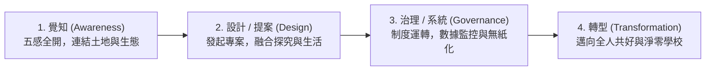
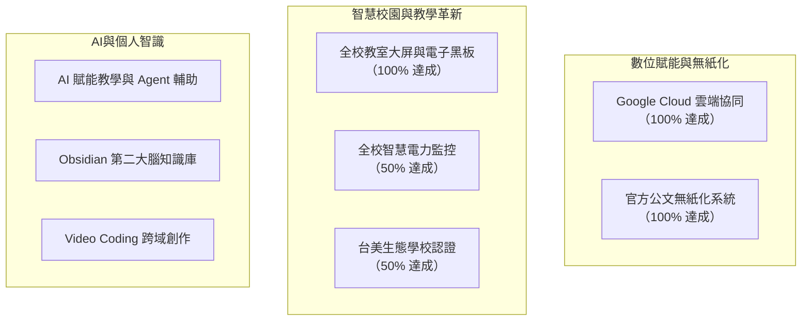

---
{"title":"憲明淨零校園藍圖：從深層覺知、在地體驗到低碳永續的微型綠色生態系","categories":["校務","部落格"],"tags":["憲明國小","淨零校園","環境教育","台美生態學校","深層生態學","食農教育","永續發展"],"status":"🌱","created":"2026-09-17T15:57:10.180+08:00","dg-publish":true,"permalink":"/Notes/憲明淨零校園/","dgPassFrontmatter":true,"noteIcon":"","updated":"2026-09-17T16:32:43.796+08:00","dg-note-properties":{"title":"憲明淨零校園藍圖：從深層覺知、在地體驗到低碳永續的微型綠色生態系","categories":["校務","部落格"],"tags":["憲明國小","淨零校園","環境教育","台美生態學校","深層生態學","食農教育","永續發展"],"status":"🌱","created":"2026-09-17"}}
---


# 憲明淨零校園藍圖：從深層覺知、在地體驗到低碳永續的微型綠色生態系

> **「淨零不是遙遠的數字競逐，而是一場讓生命重新連結自然的溫柔覺醒。從一棵老樹、一片農園、一間無紙化教室開始，我們在憲明為孩子預約綠色未來。」**

當全世界都在探討 2050 淨零排放（Net Zero）的願景時，教育的現場該如何回應這場歷史性的永續挑戰？坐落於宜蘭三星鄉天送埤的 **憲明國小**，背倚蔥蘢山巒、環抱清冽清澈的安農溪水源，是一所擁有豐沛自然生機的精緻小校。

面對氣候變遷與資源耗竭，我們深信：小學校正是實踐綠色轉型最靈巧、最深邃的「微型生態試驗場」。這份 **「憲明淨零校園藍圖」**，以 **「覺知、設計、治理、轉型」** 為心法演進脈絡，透過 **「活動、創能、系統、物件」** 四大具體維度，勾勒出憲明邁向低碳、永續與智慧校園的完整路徑。

---

## 一、轉型的四部曲：從心靈覺知到組織新生

真正的永續，不可能單靠由上而下的政令宣導，必須從個體的內在覺知自然生長。在憲明淨零校園的頂層架構中，我們確立了四個環環相扣的演進階段：



1. **覺知（Awareness）**：透過正念靜心與自然觀察，讓師生打破「人與自然二元對立」的框架，真正看見老樹、土壤、流水與氣候的脈動。
2. **設計／提案（Design & Proposal）**：引導孩子針對生活中的浪費與耗能發起微型提案，在動手實作中將理想轉化為具體方案。
3. **治理／系統（Governance & System）**：透過校務雲端化、智慧電力監控與生活常規建立，使低碳行動化為日常呼吸般的自然秩序。
4. **轉型（Transformation）**：打破校園邊界，將綠色經驗延伸至天送埤農村社區，構築親師生與土地共榮的永續生態圈。

---

## 二、維度一：活動（Activities）—— 走入山林的真實體驗

淨零教育絕不該只停留在教科書的定義，必須是一連串在風雨、泥土與歡笑中的沉浸式探索。

```
「給孩子一座森林，他會學會敬畏；給孩子一片農園，他會懂得分寸。」
```

### 1. 山林體驗與傳統智慧
* **汲取原鄉與先民生態智慧**：走讀在地山徑步道，邀請耆老與文史工作者傳授先民因地制宜、敬山愛林的共生智慧，體會「取之有度、用之有節」的深層生態倫理。
* **戶外冒險與挫折容忍**：結合山野教育，訓練孩子在自然環境中的自我照顧與團隊互助能力。

### 2. 在地學與走讀體驗
* **天送埤聚落深度走讀**：將課程搬至社區老街、五分仔火車站與灌溉水圳，調查聚落綠色人文紋理。
* **綠色校慶與在地園遊會**：倡導「無塑、在地、自備餐具」的校園活動體驗，展現在地食農與綠色手作成果。
* **縣外永續參訪與文化交流**：走出宜蘭，帶領孩子觀摩各地的生態建築與綠色社群，拓展宏觀視野。

### 3. 多元展演與分站式學習
* **學習成果展演**：打破紙筆測驗限制，採用「分站教育」形式，讓學生輪流擔任小小解說員，向學弟妹、家長與訪客展示他們的植物調查日記與減碳成果。

### 4. 健康飲食與食農教育
* **優質午餐教育與少碳足跡**：落實「地產地消」，優先採購三星在地有機米與在地蔬菜，大幅縮短食物里程。
* **全方位營養教育**：引導學生認識原型食物，理解高纖、少加工飲食對身心健康與降低碳排的雙重效益。
* **校園農園實作**：讓學生親手播種、除草、堆肥、採收，體驗「粒粒皆辛苦」的生命流動。

### 5. 校園老樹親護行動
* 憲明校園內擁有多株蒼勁珍貴的老樹，是校園最溫柔的守護者。我們推動「認養老樹、樹冠觀察、樹枝修整與落葉堆肥」，讓孩子撫摸粗糙樹皮、聆聽林梢風聲，在童年記憶中種下一份對生命的永恆眷戀。

---

## 三、維度二：創能（Innovation）—— 智慧科技與數位賦能

邁向淨零，科技不是阻力，而是最強大的加速器。我們善用現代數位工具，化繁為簡，消除無謂的行政內耗與紙張浪費。



### 1. 台美生態學校（Eco-Schools, 進度 50%）
* 積極接軌國際最具公信力的環境認證體系，由學生組成生態行動小組，針對「能源、水資源、廢棄物、氣候變遷」等面向進行自主環境檢視與行動方案推動。

### 2. 智慧科技與教學硬體全面升級
* **班級大屏與電子黑板普及（進度 0%）**：淘汰傳統粉筆與高耗損耗材，全校各班教室全面導入大尺寸觸控螢幕與電子黑板，提供高解析、護眼且互動性極佳的教學環境。
* **校園科技化建設（進度 35%）**：持續佈建智慧感測節點與高覆蓋率的校園資訊網絡。

### 3. 電力監控與能源透明化（進度 50%）
* 建置全校智慧分路電表與電力監控系統，將抽象的千瓦小時（kWh）轉化為師生隨時可見的視覺化圖表，讓節電成為一場即時互動的集體修煉。

### 4. 全面文件電子化（進度 100%）
* **Google Cloud 協同作業**：所有教案、會議記錄與活動相片全面歸檔至雲端，消除紙本列印。
* **公文系統百分之百線上簽核**：落實公文全流程無紙化，極簡行政，為地球保留更多綠林。

### 5. 人工智慧（AI）深度融入教與學
* **AI 輔助個別化教學**：利用生成式 AI 輔助差異化教材生成，釋放教師備課心力，更專注於陪伴。
* **第二大腦（Obsidian PKM）**：推動師生運用 Markdown 與雙向連結筆記工具，將日常靈感與學習經驗外顯化，落實長青思維。
* **AI Agent 與 Video Coding 跨域學習**：培養高年級學生善用 AI 輔助進行影像創作與程式編程，培育未來的數位公民素養。

### 6. 全人關懷：普及個別化支持（IEP）與特色校隊
* 將「個別化教育計畫（IEP）」的精神普及化，關注每位弱勢與特殊需求學生的個別節奏。
* 善用特色球隊（如籃球校隊）深化學生的自主管理與身心堅韌度。

---

## 四、維度三：系統（Systems）—— 課程扎根與低碳治理

淨零不應是外加的「活動」，必須化為學校的「正式課程」與「治理結構」。

### 1. 深度校訂課程：主題式教育（PBL & WebQuest）
* **PBL 專題導向學習**：以真實環境問題為導向（例如：「如何改善憲明落葉廚餘處理？」、「天送埤水資源如何循環？」），讓孩子分組進行田野調查、訪談與動手解決。
* **WebQuest 網路探究學習**：設計結構化的數位探究任務，引導孩子在浩瀚網路世界中辨識假訊息、提煉可靠的環境知識。

### 2. 生態調查與生物多樣性監測
* 建立校園動植物調查專題，定期由師生記錄校園內的喬木、灌木、鳥類、昆蟲與兩棲類動物，建立專屬憲明的「校園生物多樣性地圖」。

### 3. 源頭減量與綠美化環境
* **落實減塑與垃圾減量**：嚴禁免洗餐具進入校園，舉辦無包裝市集，落實落葉與生廚餘堆肥化。
* **在地植栽綠美化**：優先選用台灣原生種與誘蝶、誘鳥植物，將校園打造成生生不息的生態踏腳石（Stepping Stone）。

### 4. 綠色低碳通勤網絡
* 倡導以 **「走路上學、單車上學、共乘上學」** 取代個別家長汽機車每日接送，既減少校門口的塞車空污，又能在晨間步行中喚醒大腦與體魄。

---

## 五、維度四：物件（Objects）—— 空間重塑與生態地標

校園的每一個物理實體，都是一部無聲的教科書。我們透過空間的綠色改造，讓環境自己說話：

| 校園綠色空間 | 核心功能與教育意義 |
| :--- | :--- |
| **🏕️ 校園露營區** | 結合戶外教育與星空夜宿，讓孩子在無光害的校園體驗克難生活與自然和諧共處。 |
| **🏀 綠建築風雨球場** | 採自然採光、優異通風與低能耗建築設計，兼顧雨天運動需求與碳排減半。 |
| **🌱 學生實踐農園** | 劃分班級菜圃，自製天然堆肥，讓每一季的餐桌都飽含孩子翻土澆水的溫度。 |
| **🏢 綠能活動中心** | 多功能體育與藝文集會中心，導入節能空調與智慧遮陽，營造社區共好的公共場域。 |
| **💧 水生生態池** | 模擬自然濕地水循環，培育本土水生植物，成為水生昆蟲與青蛙的天然庇護所。 |
| **🏛️ 鄉土在地文物館** | 典藏天送埤林鐵與聚落墾拓文物，讓孩子在撫摸歷史中看見人與土地的百年變遷。 |

---

## 六、結語：每一間教室，都是改變世界的綠色起點

在我們的心智圖中央，特別標註了一句深刻的核心宣言：

> **「每間教室（Progress: 100%）」**

這意味著：淨零轉型從不只發生在校長室的藍圖上，也不只是行政人員的填表指標；它必須百分之百地落實到每一間普通教室、每一次課堂對話、每一個孩子的抽屜與便當盒裡。

從天送埤出發，我們不求奢華的大型硬體，而是腳踏實地地：
* 用 **正念覺知** 喚醒孩子對環境的愛；
* 用 **主題式探究與山林體驗** 賦予孩子改變世界的問題解決能力；
* 用 **智慧科技與無紙化系統** 展現理性精準的減熵治理；
* 在 **綠建築、農園與老樹濃蔭** 下，見證一所小學校為地球許下的永續諾言。

當憲明國小的孩子走出校園時，他們帶走的將不僅僅是優異的成績，更是一顆懂得與萬物平等相處、富有生態智慧的純淨心靈。

---

### 關聯資源與延伸閱讀
* 原始心智圖源：`Mindomo: 28淨零校園`
* 關聯子圖導航：
  * 台美生態學校實踐架構：`<map:706049f14e694fc18f6b56af4b544486>`
  * 校園科技化推進圖：`<map:9cceaa5be2f839ced1c96a82caafcecf>`
  * 校園系統思考總圖：`<map:c450282a054df2535a5019f34d3c3251>`
  * 學校永續經營之道：`<map:87dbce11bee046b1ae751118f38be166>`
* 推薦閱讀：
  * [[Notes/憲明SPTS\|憲明SPTS]]
  * [[wiki/憲明國小_深層生態學導入方案\|憲明國小_深層生態學導入方案]]
  * [[Notes/熵減憲明國小經營方針\|熵減憲明國小經營方針]]
  * [[Notes/熵減憲明國小具體措施\|熵減憲明國小具體措施]]
