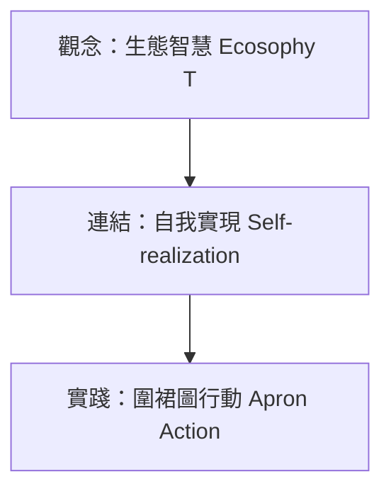

---
{"categories":"wiki","tags":["wiki","wiki/school","wiki/ecology"],"status":"🌱","sourceType":"📥/✨","created":"2026-07-15T21:07:25.311+08:00","sources":["[[raw/Naess 深層生態學研究-論文.pdf]]","[[Notes/生理性嘆息研究.md]]"],"dg-publish":true,"permalink":"/wiki/憲明國小_深層生態學導入方案/","dgPassFrontmatter":true,"noteIcon":"","updated":"2026-09-17T14:06:53.786+08:00","dg-note-properties":{"categories":"wiki","tags":["wiki","wiki/school","wiki/ecology"],"status":"🌱","sourceType":"📥/✨","created":"2026-07-15","sources":["[[raw/Naess 深層生態學研究-論文.pdf]]","[[Notes/生理性嘆息研究]]"]}}
---

# 憲明國小「生態智慧 T」深層生態學導入方案

本方案以宜蘭縣三星鄉憲明國小（6個班級、58位小朋友）為藍本，由校長行政與教學視角出發，將挪威哲學家 [[Notes/阿恩·奈斯\|阿恩·奈斯]]（Arne Naess）的「深層生態學」轉化為偏鄉精緻小校的可行特色課程與校園生活實踐。

## 1. 核心理念：從「淺層保護」到「深層共融」
* **淺層生態學**：教導垃圾分類、資源回收、節能減碳（仍以人类利益與工具價值為中心）。
* **深層生態學（本校宗旨）**：引導孩子建立「生態中心主義」世界觀，體會人與自然是共同依存的「完形整體」，地球萬物擁有平等的內在價值。

## 2. 三大推動方案

### 方案一、觀念形塑（Ecosophy）：校本課程的「完形」重構
不增加教師行政與教學負擔，而是將現有自然課的「植物特徵與分類」教案進行體驗升級：
1. **二分法到生命故事**：引導孩子在校園挑選一棵最「有感覺」的大樹，撰寫觀察日記與畫下完形特徵，建立與該植物的「夥伴（你）」關係，而非純研究的「客體（它）」。
2. **節氣與自然規律**：結合宜蘭三星當地的節氣與自然現象，開展節氣小旅行，感受四季「變易」與大地「不易」的規律。

### 方案二、關係建立（Self-realization）：尋找憲明的「小木屋」
借鏡奈斯隱居修行之「Tvergastein 小木屋」精神，在校園為 70 位小朋友創造專屬的感官與心靈共鳴體驗：
1. **大樹下的靜默十分鐘**：利用晨光或課間實施「[[Notes/生理性嘆息研究\|生理性嘆息]]（雙吸一吐）」正念靜觀，引導孩子在自然的蟲鳴風聲中沉澱，消融人與環境的感官界線。
2. **生物平等的校園微棲地**：在校園一角劃設完全不打擾、不除草的「昆蟲野花區」，落實「生態平等主義」，讓孩子體會昆蟲與人類在校園的共生平等權。

### 方案三、圍裙行動（Apron Action）：小校的綠色公民實踐
依據圍裙圖（Apron Diagram）邏輯，將土地情感（第一、二級）轉化為具體的校園與社區綠色行動（第三、四級）：
1. **台美生態學校自主專案**：高年級學生組成生態小議會，調查校園的資源耗能並自主設計解決方案。
2. **混齡協作生態市集**：打散班級進行混齡協作，利用校園落葉堆肥種植無毒作物，實踐生態循環經濟的早期體驗。

## 3. 校長的行政推動策略
* **教師減負，有機融合**：不增加额外指標評鑑，將方案有機融入現有特色學校或戶外教育經費中。
* **校長率先行示範**：每日清晨於大樹下與孩子一同呼吸沉澱，溫柔且堅定地落實尊重生命的校園風氣。

---
Path: wiki/憲明國小_深層生態學導入方案.md
